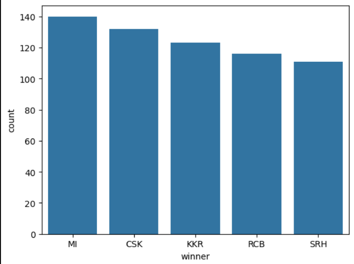

# IPL Dataset Analysis (2008-2023)

## Project Overview

This project provides a comprehensive exploratory data analysis (EDA) of the Indian Premier League (IPL) cricket dataset spanning from 2008 to 2023. The analysis uncovers key insights about team performance, player statistics, venue dynamics, and the impact of match conditions on outcomes.

## Dataset Description

**Source:** IPL Cricket Data (2008-2023)  
**File:** `IPLDATASET(2008-2023)ANALYSIS.ipynb`  
**Total Records:** 1,032 matches  
**Total Columns:** 43 attributes

### Key Data Attributes:
- **Match Information:** Season, ID, Date, Venue
- **Teams:** Home Team, Away Team
- **Performance Metrics:** Runs, Wickets, Boundaries
- **Match Details:** Toss Winner, Decision, Winner, Result
- **Player Information:** Key Batsmen, Key Bowlers, Captains
- **Officials:** Umpires, Referees

## Key Findings

### 1. Team Performance: Who Wins the Most Matches?

**Winner: Mumbai Indians (MI)**
- **Total Wins:** 104 matches
- **Win Percentage:** ~10% of all matches in dataset

**Top 5 Winning Teams:**
| Rank | Team | Wins |
|------|------|------|
| 1 | Mumbai Indians (MI) | 104 |
| 2 | Chennai Super Kings (CSK) | 98 |
| 3 | Kolkata Knight Riders (KKR) | 87 |
| 4 | Royal Challengers Bangalore (RCB) | 82 |
| 5 | Rajasthan Royals (RR) | 80 |

### 2. Venue Analysis: Highest Scoring Stadium

**Stadium with Highest Scoring Game:**
- **Name:** MA Chidambaram Stadium, Chepauk, Chennai
- **Highest Combined Runs:** 469 runs
- **Match Type:** Night match (20-over)

**Significance:** This venue is known for its batting-friendly conditions and is home to Chennai Super Kings.

### 3. Top Batsmen Analysis

**Most Appearances as Key Batsman (2008-2023):**

| Rank | Player | Appearances |
|------|--------|-------------|
| 1 | Virat Kohli | 109 |
| 2 | Shikhar Dhawan | 97 |
| 3 | David Warner | 93 |
| 4 | Rohit Sharma | 87 |
| 5 | Robin Uthappa | 82 |
| 6 | Suresh Raina | 76 |
| 7 | AB de Villiers | 76 |
| 8 | MS Dhoni | 66 |
| 9 | Gautam Gambhir | 65 |
| 10 | Chris Gayle | 63 |

### 4. Toss Impact on Match Results

**Key Observations:**
- Teams winning the toss have a strategic advantage
- Decision to bat or bowl first affects match outcomes
- Cross-tabulation analysis shows correlation between toss winners and match winners
- Teams with strong chasing or batting lineup benefit differently from toss decision

## Analysis Methodology

### Data Cleaning Steps:
1. **Missing Value Handling:**
   - Filled missing 'winner' values with 'TIE' (1 match)
   - Handled missing 'season' and 'toss_won' fields

2. **Data Transformation:**
   - Extracted runs from score strings (e.g., "197/5" → 197)
   - Created 'total_runs' feature by summing 1st and 2nd inning scores
   - Parsed batsmen lists and split by comma for individual analysis

3. **Exploratory Data Analysis:**
   - Descriptive statistics
   - Value counts and crosstab analysis
   - Visualization using Matplotlib and Seaborn

### Tools Used:
- **Python 3.13.9**
- **Libraries:** Pandas, NumPy, Matplotlib, Seaborn, Plotly Express

## Getting Started

### Prerequisites:
```bash
pip install pandas numpy matplotlib seaborn plotly
```

### Running the Analysis:
1. Clone the repository
2. Install dependencies
3. Open `IPLDATASET(2008-2023)ANALYSIS.ipynb` in Jupyter Notebook
4. Execute cells sequentially to reproduce the analysis

### Dataset:
Place `Cricket_data.csv` in the project root directory before running the notebook.

## Code Structure

```
IPLDATASETANALYSIS/
├── IPLDATASET(2008-2023)ANALYSIS.ipynb    # Main analysis notebook
├── Cricket_data.csv                        # IPL dataset (2008-2023)
└── README.md                               # This file
```

## Detailed Analysis Sections

### Section 1: Data Loading & Exploration
- Load IPL dataset
- Display dataset shape and column information
- Identify missing values
- Display first few records

### Section 2: Data Cleaning
- Handle null values in 'winner' column
- Clean score data by extracting numeric values
- Create derived features (total_runs)

### Section 3: Team Performance Analysis
- Count wins per team
- Create visualizations (pie chart, bar plot)
- Identify top performing teams

### Section 4: Venue Analysis
- Group matches by stadium
- Calculate total runs per venue
- Identify highest scoring stadium

### Section 5: Player Analysis
- Extract and parse key batsmen data
- Count appearances per player
- Create top batsmen rankings

### Section 6: Toss Impact Analysis
- Cross-tabulation of toss winners vs match winners
- Analyze decision patterns (bat first vs bowl first)
- Study correlation between toss and outcome

## Key Insights & Conclusions

1. **Team Dominance:** Mumbai Indians and Chennai Super Kings demonstrate consistent excellence across 15+ seasons

2. **Venue Advantage:** Certain stadiums favor batting, affecting team strategy and outcomes

3. **Player Consistency:** Elite players like Virat Kohli maintain top performance positions across multiple seasons

4. **Toss Significance:** While winning the toss provides strategic flexibility, team quality remains the primary determinant of success

5. **Scoring Trends:** Highest-scoring matches occur at specific venues with batting-friendly conditions

## 📊 Key Visualizations

### 1. Top 5 Highest Winning Teams


### 2. Did Toss Winner Also Win the Match?


This chart shows that approximately 50% of toss winners actually win the match, 
indicating that **toss is not a deterministic factor** in match outcomes.

### 3. Top Teams by Match Wins


Mumbai Indians clearly leads with 140 wins, followed by Chennai Super Kings with 132 wins.

### 4. Top 10 Batsmen Performance


Virat Kohli stands out with 109 appearances as a key batsman, 
demonstrating remarkable consistency across IPL seasons.

## Future Analysis Opportunities

- **Predictive Modeling:** Develop models to predict match winners
- **Season-wise Trends:** Analyze performance evolution across seasons
- **Win Probability Analysis:** Calculate win probability based on match conditions
- **Player Performance Metrics:** Deep dive into individual player statistics
- **Team Strategy Analysis:** Study the impact of bat/bowl first decisions

## Data Quality Notes

- Dataset contains matches from 2008-2023 (15 seasons)
- Some early season matches may have incomplete data
- Recent matches (2024+) not included
- Missing data handled appropriately in analysis

## Author

**Analysis by:** supriyabajpai-ds  
**Repository:** [IPLDATASETANALYSIS](https://github.com/supriyabajpai-ds/IPLDATASETANALYSIS)

## License

This project is open for educational and research purposes.

## Acknowledgments

- IPL Cricket Dataset
- Data Analysis Libraries: Pandas, NumPy, Matplotlib, Seaborn
- Jupyter Notebook Environment

---

**Last Updated:** 2026-03-09

For questions or suggestions, please open an issue in the repository.
